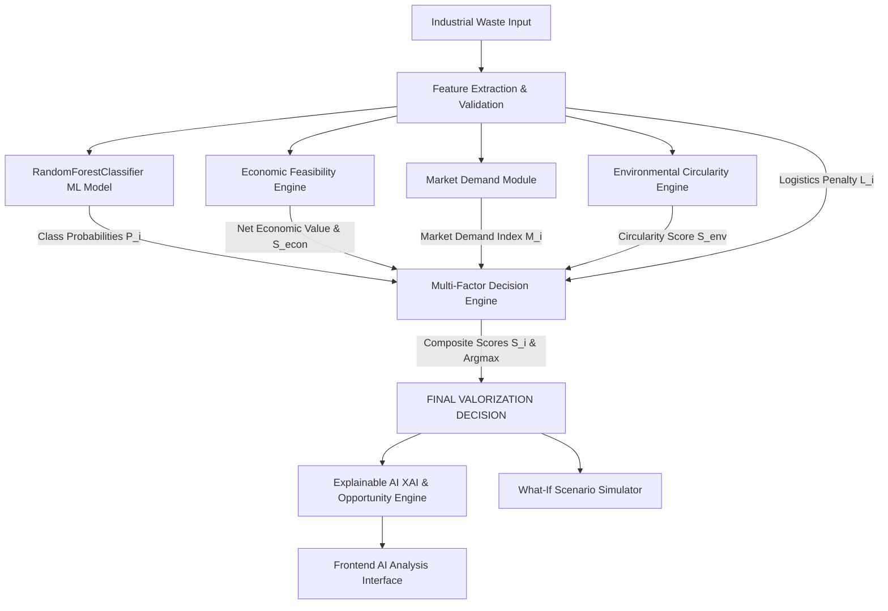

# EcoValor AI — Waste Valorization Decision Engine Architecture

> **CORE PRINCIPLE & ARCHITECTURAL SEPARATION**  
> In EcoValor AI, the **Machine Learning model predicts pathway suitability probabilities** based on physical waste characteristics. A separate, transparent **Multi-Factor Decision Engine** synthesizes ML inference with economic feasibility, market demand, environmental hierarchy, and logistics to determine the final valorization recommendation.  
> The system **never relies on an LLM for decision making**; language models or narrative synthesizers receive the pre-calculated decision payload strictly to format human-readable executive briefings.

---

## 1. System Architecture & Decision Flow

---

## 2. Multi-Factor Decision Formula

For each candidate pathway $i \in \{\text{Reuse, Recycling, Material Recovery, Energy Recovery, Disposal}\}$, the composite score $S_i \in [0, 100]$ is computed as:

$$S_i = \left( w_{\text{ML}} \cdot P_{\text{ML}, i} \times 100 \right) + \left( w_{\text{econ}} \cdot S_{\text{econ}, i} \right) + \left( w_{\text{mkt}} \cdot M_i \times 100 \right) + \left( w_{\text{env}} \cdot S_{\text{env}, i} \right) - \left( w_{\text{log}} \cdot L_i \right)$$

### Configurable Default Weights (Sum = 1.0)
- **$w_{\text{ML}} = 0.35$ (35%):** ML Model suitability probability representing empirical physical feasibility.
- **$w_{\text{econ}} = 0.25$ (25%):** Net Economic Value ($NEV$) score balancing gross material recovery value against processing and logistics costs.
- **$w_{\text{mkt}} = 0.15$ (15%):** Industrial market demand level and secondary offtaker liquidity index.
- **$w_{\text{env}} = 0.20$ (20%):** European/EPA Waste Hierarchy circularity score and landfill diversion efficiency.
- **$w_{\text{log}} = 0.05$ (5%):** Logistics and distance friction penalty.

The recommended valorization pathway is:
$$\text{Recommended Pathway} = \arg\max_{i} (S_i)$$

---

## 3. Component Engines

### 3.1 Economic Feasibility Engine (`economic_engine.py`)
Calculates the Net Economic Value ($NEV_i$) for each pathway:
$$NEV_i = \text{Gross Recoverable Value}_i - \left( \text{Processing Cost}_i + \text{Pre-treatment Surcharge}_i + \text{Transport Freight Cost}_i \right)$$

- **Gross Value:** Derived from batch mass, purity percentage, pathway yield factor (Reuse: 95%, Recycling: 85%, Material Recovery: 78%, Energy: 90%), and secondary market benchmark pricing.
- **Processing Cost:** Base cost per tonne adjusted by pathway complexity and contamination penalty.
- **Logistics Cost:** Freight rate per tonne-kilometer multiplied by distance and tonnage.
- **Economic Feasibility Score ($S_{\text{econ}, i}$):** Scaled normalized score from 0 to 100 representing financial return viability.

### 3.2 Market Demand Module (`market_engine.py`)
Provides structured, non-hallucinated prototype reference indices for secondary industrial commodities:
- Structured matrix categorizing 11 industrial waste streams across 5 pathways.
- Attributes: `demand_level` (High, Medium, Low), `demand_index` (0.10 to 0.98), `offtaker_liquidity` (High, Medium, Low), and `price_stability`.
- Configurable reference matrix; does not falsely claim to be a live financial exchange ticker.

### 3.3 Environmental Circularity Engine (`environmental_engine.py`)
Aligns decision weighting with certified sustainability hierarchy:
- **Hierarchy Base Circularity:** Reuse (96), Recycling (82), Material Recovery (74), Energy Recovery (52), Disposal (8).
- **Landfill Diversion Potential:** Reuse (98%), Recycling (92%), Material Recovery (85%), Energy Recovery (75%), Disposal (0%).
- **Logistics Emissions:** Estimated transport carbon footprint using 0.105 kg CO2e / tonne-km freight factor.

---

## 4. Explainable AI & What-If Simulation

### 4.1 Transparent Reason Generation (`explainability.py`)
- Audits specific positive drivers (e.g., composition purity, short freight distance, high offtaker liquidity) and operational constraints (e.g., elevated moisture, high pre-treatment surcharge).
- Produces a clear, factual executive narrative citing exact quantitative metrics.

### 4.2 What-If Scenario Simulator
Enables industrial plant engineers to adjust operational levers:
- Adjust batch mass, contamination percentage, moisture level, processing cost, or transport distance.
- Recalculates ML probabilities, economic revenues, environmental diversion, and composite scores.
- Displays a side-by-side **Current Scenario vs What-If Scenario** comparison with explicit delta values.

### 4.3 Waste $\rightarrow$ Opportunity Framework
Transforms waste from a compliance liability into a circular asset:
- Quantifies recoverable secondary raw material in kilograms.
- Projects potential gross and net economic asset recovery.
- Recommends actionable operational optimization levers (e.g., optimal sorting thresholds, regional offtaker sourcing).

---

## 5. Prototype Assumptions & Disclaimers

1. **Benchmark Reference Pricing:** Resale benchmark prices represent prototype circular economy reference averages. They do not constitute binding commercial price quotes.
2. **Deterministic Synthesis:** Multi-factor weights are transparently configured and auditable.
3. **No LLM Decision Control:** Language models are strictly confined to narrative presentation; all pathway scores and selection mechanics are computed deterministically.
